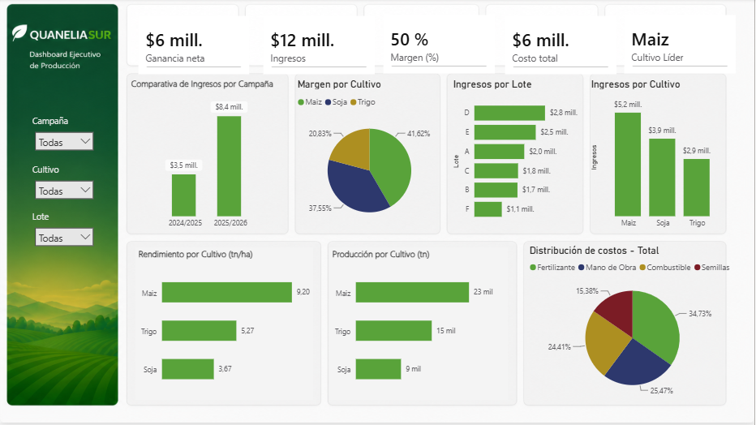

# 🌱 Quanelia Sur 1.0

## Dashboard Ejecutivo de Producción

Este es mi primer proyecto de análisis de datos desarrollado en Power BI.

El objetivo fue crear un dashboard interactivo para analizar información de campañas agrícolas, permitiendo visualizar indicadores clave como ingresos, costos, margen de ganancia, producción, rendimiento e ingresos por lote.

En este proyecto utilicé Power Query para preparar los datos, DAX para crear las medidas y Power BI para diseñar el dashboard.

## 🛠️ Herramientas utilizadas

- Power BI
- Power Query
- DAX
- Modelado de datos

## 📊 Indicadores principales

- Ganancia neta
- Ingresos
- Margen (%)
- Costo total
- Cultivo líder
- Producción por cultivo
- Rendimiento por cultivo
- Ingresos por lote
- Distribución de costos

## 📚 Lo que aprendí

Con este proyecto aprendí a:

- Crear un modelo de datos sencillo.
- Relacionar tablas correctamente.
- Construir medidas en DAX.
- Diseñar un dashboard pensando en que sea claro y fácil de interpretar.
- Utilizar segmentadores para que los gráficos respondan dinámicamente.

Este proyecto representa el inicio de mi portfolio como Analista de Datos.
Mi próximo objetivo es desarrollar una nueva versión de este proyecto incorporando SQL. Ese será mi siguiente paso: QuaneliaSur_2.0.

Nota: QuaneliaSur es un nombre ficticio creado exclusivamente para este proyecto de portfolio y no representa una empresa real.
